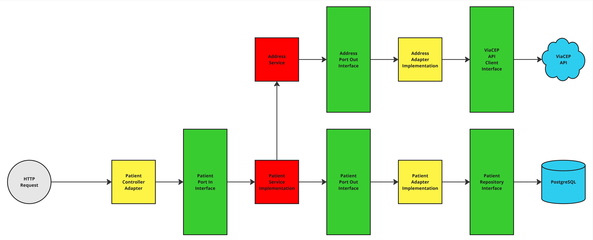

# Hackathon Fiap - Fase 5

## Pós Tech - Arquitetura e Desenvolvimento Java - Fiap - 2024/25

## Glicontrol - Sistema de gerenciamento de resultado de exame e agendamento

**Microsserviço desenvolvido por:** Welder Ressutti

- **Grupo 11:**
    - Pedro Ono - RM 354950
    - Elton Xavier Souza - RM 354254
    - Welder Ressutti - RM 99070

## Microsserviço de Gerenciamento de Pacientes

Sua responsabilidade dentro do sistema **Glicontrol**, é de realizar o gerenciamento de pacientes, realizando operações
**CRUD**.

Foi utilizado banco de dados relacional **PostgreSQL** para persistência dos dados, integrado com gerenciamento de
migração de schemas usando **Flyway**.

Foram criadas exceções personalizas que são tratadas globalmente pelo **Rest Controller Advice** e **Exception
Handler**, que retorna uma classe de erro contendo **timestamp**, **status code**, **error**, **message** e **path**.

Possui integração por comunicação síncrona utilizando **OpenFeign** com a API **ViaCEP** para obter o endereço completo
do paciente.

## Funcionalidades e Endpoints

### Criação de Paciente (POST)

**Endpoint:** ``/api/patient``

É realizado validação completa e limpeza dos dados de entrada utilizando padrões **RegEx**, impedindo inconsistência de
dados. Todos os dados da requisição são **obrigatórios** e os campos de **celular**, **CPF** e **CEP**, podem ser
enviados formatados ou não.

Exemplo de formatações aceitas:
``
Celular: 11-111111111 ou 11111111111 | CPF: 111.111.111-11 ou 11111111111 | CEP: 11111-111 ou 11111111
``

Já na camada **core** da aplicação, dentro da classe de domínio **CPF**, é utilizado um
algoritmo que verifica se o **CPF** é válido/verdadeiro.

O usuário deve informa apenas o **CEP** e **número** do seu endereço, as demais informações do endereço serão
preenchidas automaticamente através da integração com a API **ViaCEP**.

O sistema **impede** o cadastro de paciente com **CPF** e/ou **e-mail** iguais.

### Atualização de Paciente (PUT)

**Endpoint:** ``/api/patient/{patientId}``

Todo o padrão de validação, limpeza e consistência de dados do processo de cadastro se matém aqui também, porém, aqui,
todos os campos são **opcionais**, pode ser enviado apenas **um**, **alguns** ou **todos** os campos para a atualização
do paciente.

### Leitura de Paciente (GET)

**Endpoint:** ``/api/patient/{patientId}`` ``/api/patient?email=`` ``/api/patient``

Pode ser obtido o paciente pelo seu **id** ou **e-mail**. Também é possível obter **todos** os pacientes de uma vez.

### Deleção de Paciente (DELETE)

**Endpoint:** ``/api/patient/{patientId}``

Para deletar um paciente basta passar seu **id** no endpoint.

*Para mais informações sobre a API, como, request, response e status code, consultar a documentação Swagger.*

## Arquitetura

A arquitetura hexagonal consiste na ideia de utilizar portas e adaptadores para realizar a integração entre a camada
externa e interna, isolando o core da aplicação para que alterações externas não interfiram nas regras de negócio e
casos de uso.

Este microsserviço foi desenvolvido seguindo os padrões de API RESTful, arquitetura hexagonal, e também respeitando os
princípios SOLID de isolamento de responsabilidades.

A arquitetura desta aplicação foi desenvolvida da seguinte forma:



## Executando a aplicação (isoladamente)

### Pré-requisitos

- **Git** (caso queira clonar o repositório, mas você pode apenas baixá-lo):
    - [Git](https://git-scm.com/downloads)
- **Docker Desktop** (para executar a aplicação através de containers):
    - [Docker](https://www.docker.com/products/docker-desktop/)

### Passo 1: Clonar ou baixar o repositório

Para clonar o repositório, use o comando:

```bash
git clone https://github.com/welderessutti/api-patient
```

Caso não queira clonar o repositório, você pode baixá-lo
em [GitHub](https://github.com/welderessutti/api-patient).

### Passo 2: Executar a aplicação com Docker

No terminal, dentro do diretório raíz do projeto (local onde se encontra o arquivo **pom.xml** da aplicação), execute o
comando abaixo para subir o container da aplicação e do banco de dados **PostgreSQL**:

```bash
docker compose up -d
```

O Docker tentará baixar a imagem no repositório
do [Docker Hub](https://hub.docker.com/repository/docker/welderessutti/api-patient/general), caso ele não
encontre a imagem, ele realizará a **build** da aplicação **(.jar)**, criará a imagem e executará os containers
automaticamente.

Antes do container da aplicação subir, ele aguardará o container do banco de dados **PostgreSQL** estar pronto
utilizando um **healthcheck**, quando pronto, o container da aplicação inicia, e realizará a migração do banco de dados
e suas tabelas automaticamente utilizando o **Flyway**, e estará disponível para acesso em:

```
http://localhost:8080/api/patient
```

## Documentação da API (Swagger UI)

A documentação da **API** pode ser acessada via **Swagger UI**. Após executar a aplicação, acesse:

```
http://localhost:8080/api/swagger-ui/index.html
```

Lá você encontrará detalhes sobre todos os endpoints disponíveis, parâmetros de requisição e resposta.


